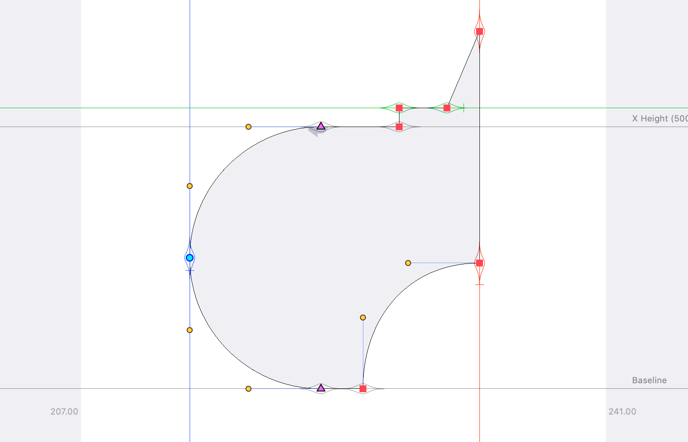

# Eyeliner

RoboFont extension that highlights points and anchors that are aligned with vertical font dimensions, 0°/90° guides, or blue zones (if set to be visible). Rest assured that your points are aligned, without having to zoom in and check (;

Eyeline shapes will match the appropriate color of whatever line it's aligning to, based on the color preferences you have set in RoboFont.

### Versions

	1.2.9 2021.03.17  Dodging tracebacks.                              
	                  Thanks Jackson Showalter-Cavanaugh.
	1.2.8 2021.01.30  Support for RF4 & code cleanup.                              
	                  PR - Thanks Frank Grießhammer.
	1.2.7 2020.09.14  Support for 180° & 270°.                              
	                  PR - Thanks Connor Davenport.
	1.2.5 2020.07.15  Guides take precedence over font dimensions.                              
	                  Support for anchors.
	1.2.1 2020.04.03  Eye is rounded to nearest unit, making it possible 
	                  to see eye during a transformation with the Transform 
	                  tool, before mouse-up.
	1.2.0 2020.03.26  Bug-fix. Allows multiple open fonts to have independent eyes. 
	                  Optimize coloring code a bit.
	1.1.1 2020.01.27  Support for blue zone edges. 
	                  Thanks for the suggestion, Jeremy Mickel.
	1.0.0 2020.01.24  Initial release
